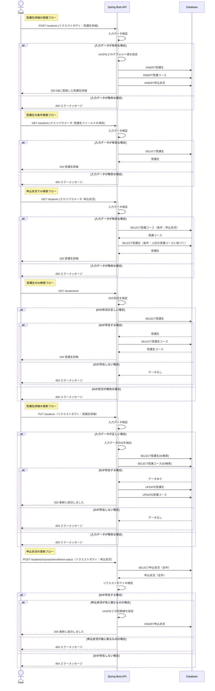

## サービス概要

このプロジェクトは、IT技術を教えるスクールが受講生の情報を保持・分析するための管理システムです。  
受講生ではなくスクール側が使用することを想定し、CRUD機能をもつがログイン機能は持たないシンプルで使いやすいことを目指した実装内容となっています。

## 作成背景

JavaやSpring Bootの学習成果を形にするために作成しました。  
実務で頻繁に使用される以下の技術やツールを採用しています。

- REST APIの設計と実装: データのCRUD操作をサポート
- 自動テスト: JUnitを使用して単体テストを実装
- AWSを使用したデプロイ: クラウド環境へのアプリケーション展開

## 主な使用技術

### バックエンド

- Java: 21.0.5
- SpringBoot: 3.3.5

### インフラ・DB

- AWS: EC2, RDS, ALB
- MySQL: 8.0.40

### 使用ツール

- O/R Mapper: MyBatis
- 自動テスト: JUnit5
- CI/CDパイプライン: GitHub Actions

## 機能一覧

| 機能       | 詳細                                                             |
|:---------|:---------------------------------------------------------------|
| 受講生詳細の登録 | 氏名や居住地域などの受講生の情報と、受講コース・申込状況をセットで登録します                         |
| 受講生の条件検索 | 氏名・居住地域などの検索条件を指定し、条件に該当する受講生詳細を取得します　                         |
| 申込状況での検索 | 申込状況を指定し、該当する受講生詳細を取得します                                       |
| 受講生のID検索 | IDを指定し、一意の受講生詳細情報を取得します                                        |
| 受講生詳細の更新 | IDを指定し、任意の受講生情報を更新します ※削除処理については論理削除として実装しているため、更新処理にて行います |
| 申込状況の更新  | IDを指定し、任意の申込状況を更新します。 誤操作を防ぐため、状況が後ろに戻るような更新は本機能では実行できません  |

※ 言葉の定義は以下のとおりです

- 受講生： 氏名、居住地域、年齢などをもつオブジェクト
- 受講コース： コース名、開始日、終了日、申込状況などをもつオブジェクト
- 申込状況： 仮申込,本申込といった申込状況、作成日などをもつオブジェクト
- 受講生詳細： 受講生、受講コース（申込状況含む）をもつオブジェクト

## 設計書

### API仕様書

### ER図

### URL設計

| HTTP メソッド | URL                                 | 処理内容                 | 備考                                |
|---------------|-------------------------------------|----------------------|-----------------------------------|
| POST          | /students                           | 受講生詳細の作成             |                                   |
| GET           | /students                           | 受講生詳細の取得             | クエリパラメータを指定した場合は条件検索をします          |
| GET           | /students/{id}                      | IDに合致する 受講生詳細の取得 |                                   |
| PUT           | /students                           | 受講生詳細の更新             |                                   |
| POST          | /students/courses/enrollment-status | 申込状況の更新              | 挙動としてはレコードをINSERTしますが、実質更新処理を行います |

### シーケンス図

### インフラ構成図

## テスト

## 自動テスト

## 作成スケジュール

## 工夫した点

- 実際のユースケースを想定した実装を行いました
  - 
    - 分析に使用できるよう、論理削除・UPDATEせずにINSERT処理
    - 申込状況更新について、後ろに戻るような修正を加える際に例外を発生させるよう実装しました
        - 該当箇所：
          - 

- 更新処理においてパフォーマンスを意識し、更新有無をチェックし、更新がある場合のみSQLを発行するように実装しました
    - 該当箇所：

## ハマった点

## 今後の展望