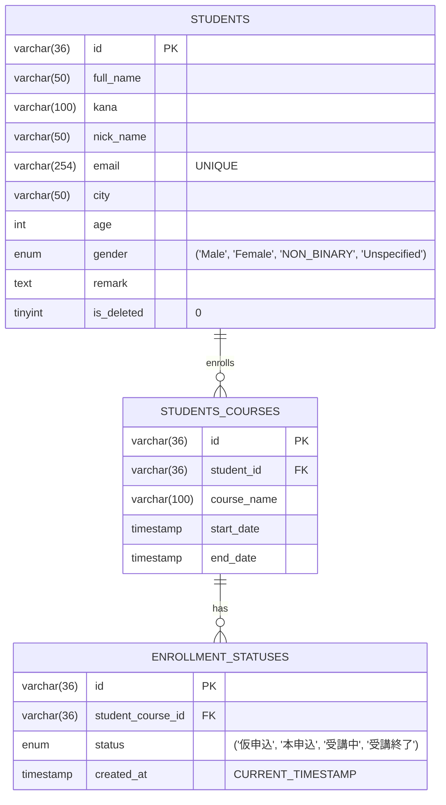
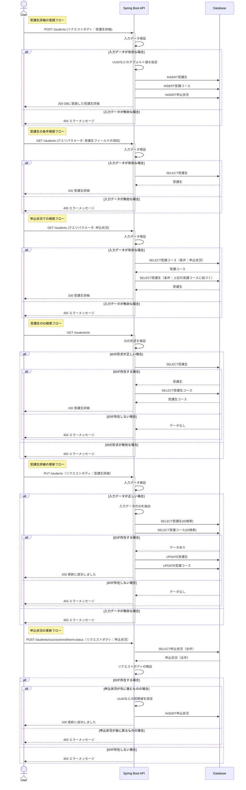

## サービス概要

このプロジェクトは、IT技術を教えるスクールが受講生の情報を保持・分析するための管理システムです。  
受講生ではなくスクール側が使用することを想定し、CRUD機能をもつがログイン機能は持たないシンプルで使いやすいことを目指した実装内容となっています。

## 作成背景

JavaやSpring Bootの学習成果を形にするために作成しました。  
実務で頻繁に使用される以下の技術やツールを採用しています。

- REST APIの設計と実装: データのCRUD操作をサポート
- 自動テスト: JUnitを使用して単体テストを実装
- AWSを使用したデプロイ: クラウド環境へのアプリケーション展開

## 主な使用技術

### バックエンド

### インフラ・DB

### 使用ツール

## 機能一覧

| 機能       | 詳細                                                             |
|:---------|:---------------------------------------------------------------|
| 受講生詳細の登録 | 氏名や居住地域などの受講生の情報と、受講コース・申込状況をセットで登録します                         |
| 受講生の条件検索 | 氏名・居住地域などの検索条件を指定し、条件に該当する受講生詳細を取得します　                         |
| 申込状況での検索 | 申込状況を指定し、該当する受講生詳細を取得します                                       |
| 受講生のID検索 | IDを指定し、一意の受講生詳細を取得します                                          |
| 受講生詳細の更新 | IDを指定し、任意の受講生詳細を更新します ※削除処理については論理削除として実装しているため、更新処理にて行います |
| 申込状況の更新  | IDを指定し、任意の申込状況を更新します。 誤操作を防ぐため、状況が後ろに戻るような更新は本機能では実行できません  |

※ 言葉の定義は以下のとおりです

- 受講生： 氏名、居住地域、年齢などをもつオブジェクト
- 受講コース： コース名、開始日、終了日、申込状況などをもつオブジェクト
- 申込状況： 仮申込,本申込といった申込状況、作成日などをもつオブジェクト
- 受講生詳細： 受講生、受講コース（申込状況含む）をもつオブジェクト

## 設計書

### API仕様書

### ER図

### URL設計

| HTTP メソッド | URL                                 | 処理内容                 | 備考                            |
|---------------|-------------------------------------|----------------------|-------------------------------|
| POST          | /students                           | 受講生詳細の作成             |                               |
| GET           | /students                           | 受講生詳細の取得             | クエリパラメータを指定した場合は 条件検索をします |
| GET           | /students/{id}                      | IDに合致する 受講生詳細の取得 |                               |
| PUT           | /students                           | 受講生詳細の更新             |                               |
| POST          | /students/courses/enrollment-status | 申込状況の更新              | 挙動としては追加しますが 実質更新処理を行います  |

### シーケンス図

### インフラ構成図

## 自動テスト

下記テストをJUnit5で作成し、GitHub Actionsでプルリクエスト作成時に実行しています。

単体テスト

- [Controller層の単体テスト](src/test/java/portfolio/StudentManagement/controller/StudentControllerTest.java)
- [Service層の単体テスト](src/test/java/portfolio/StudentManagement/service/StudentServiceTest.java)
- [Converterの単体テスト](src/test/java/portfolio/StudentManagement/controller/converter/StudentConverterTest.java)

DBテスト

- [StudentモデルのDBテスト](src/test/java/portfolio/StudentManagement/controller/converter/StudentConverterTest.java)
- [StudentCourseモデルのDBテスト](src/test/java/portfolio/StudentManagement/repository/StudentCourseRepositoryTest.java)
- [EnrollmentStatusモデルのDBテスト](src/test/java/portfolio/StudentManagement/repository/EnrollmentStatusRepositoryTest.java)

## 力をいれたところ

- **ユースケースに基づいた設計** 
  分析に活用することを想定し、既存のレコードを保持するようなDB処理を行っています。 
  具体的には、「受講生の削除機能をUPDATE処理を使い論理削除として実装」、「申込状況の更新機能をINSERT処理として実装」といった対応をしています。これにより、以下のようなデータ活用が可能です。
    - 受講生の論理削除
        - 退会者属性の傾向を分析し、マーケティングに役立てる
        - 退会者数をKPIとしてモニタリングし、一定水準を下回った場合に早期に着手できるようにする
    - 申込状況のINSERT処理
        - 仮申込状況・本申込状況の期間をカスタマーサクセスチームのKPIとして設定する
        - 受講期間をモニタリングし、講座難易度の調整に役立てる

- **効果的なバリデーション、例外処理** 
  正規表現などを用いてバリデーションを設定しました。 
  また、エラーがあった際にユーザーが適切に修正できるよう、 バリデーションエラー、ID検索の際のNot
  Foundエラー、意図していない操作をされた際のBadRequestエラーなどのハンドリングを行い、クライエント側にエラーメッセージが表示されるようにしました。

- **実装意図が伝わりやすいコーディング・ドキュメント作成** 
  具体的には以下の3点を行いました
    - コード内でのドキュメント作成：主要なクラス・メソッドにJavadocやOpenAPIアノテーションを利用したドキュメントを記述しました
    - 命名へのこだわり: 命名から挙動を想定できるよう、クラス名・メソッド名を工夫しました
    - 読みやすいレビュー依頼: プルリクエストでのレビュー依頼時に概要を把握しやすいよう、変更点・変更目的・特にレビューいただきたい箇所などを明示しました

## 今後の展望

- フロントエンドの実装
- インフラ構成の修正：SSMとS3を使用し、EC2のIPアドレスが変わっても動くように修正
- アカウント作成・ログイン機能の実装
- テーブルを跨いだ検索機能の実装
- 結合テストの自動テストを作成